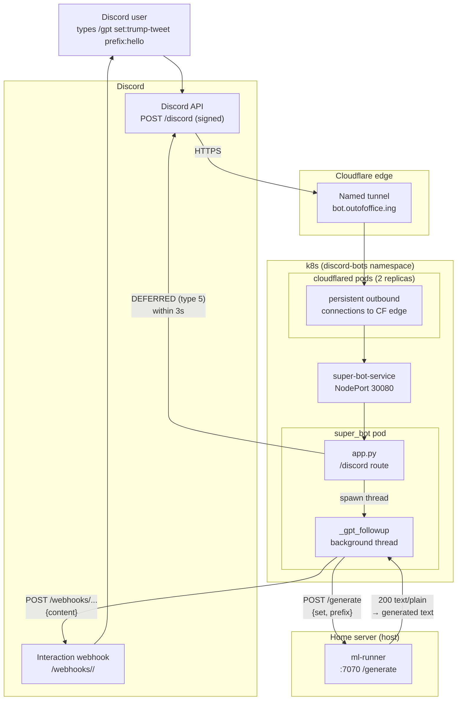
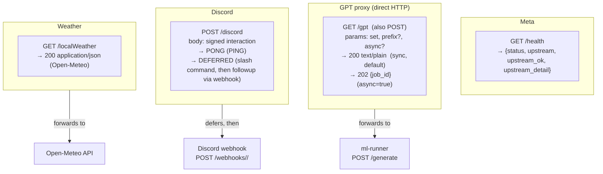
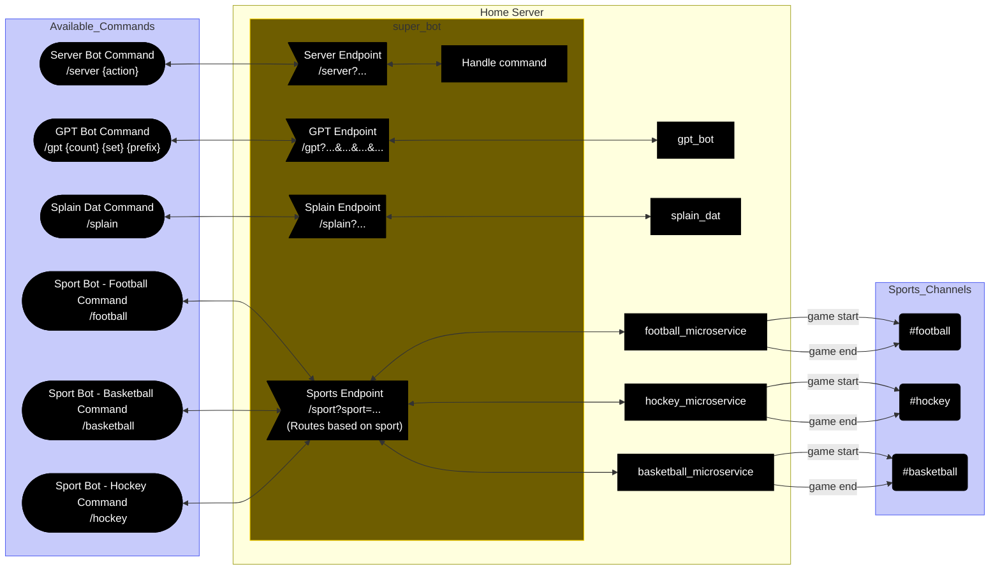

# super_bot

The router for the OUT OF OFFICE Discord server. A thin Python (Flask) app
that receives external requests — both HTTP (for direct/scripted use) and
Discord interactions (via the Interactions Endpoint) — and dispatches them to
the right backing microservice on the home server. Right now the only backing
service is [`ml-runner`](../discord_gptbot/ml-runner) (GPT-2 generation); more
(sports bots, server management, etc.) are planned.

Replaced an earlier Java/Vert.x skeleton with Python to match the rest of the
stack (ml-runner is also Flask) and to make the Discord Interactions Endpoint
straightforward to implement.

## What's here

- **`app.py`** — the Flask app. Exposes:
  - `/health` — liveness + a ping to the upstream `ml-runner`.
  - `/gpt` (GET/POST) — a direct HTTP proxy to ml-runner's `/generate`. Same
    params, same forms (query string, JSON, or form-encoded) as `/generate`.
  - `/discord` (POST) — the Discord Interactions Endpoint. Verifies
    Discord's Ed25519 signature, handles PING, and dispatches slash commands.
    The `/gpt` slash command defers within Discord's 3s window and POSTs the
    generated text to the interaction's followup webhook once ml-runner
    returns (GPT generation can exceed 3s).
  - `/localWeather` — proxies Open-Meteo (carried over from the Java skeleton).
- **`register_commands.py`** — a one-shot admin script to register/update the
  slash-command definitions with Discord. Run it locally (not in the cluster)
  whenever the command set changes. Uses the bot token (a real secret, kept
  out of git) to authenticate to Discord's REST API.
- **`Dockerfile`** — `python:3.11-slim` + gunicorn, `--timeout 600` to match
  ml-runner. Bakes the Discord app credentials (non-secret) in as defaults.
- **`.github/workflows/`** — CI: `main.yml` builds + pushes the Docker image to
  GHCR on push to main; `pr.yml` builds the image and runs a smoke test that
  boots the container and asserts `/health` returns `200 status:"ok"`.

## Quick architecture

```
Discord (interactions) ─┐
                        │  POST /discord (HTTPS, signed)
                        ▼
                  Cloudflare Tunnel (cloudflared, in-cluster)
                        │  http://super-bot-service:8080
                        ▼
                  super_bot (Flask, gunicorn, k8s)
                        │  /gpt → POST $ML_RUNNER_URL/generate
                        ▼
                  ml-runner (on the host, :7070)
                        │  conda run -n gpt2 ...
                        ▼
                  GPT-2 117M (torch + transformers)
```

Direct HTTP callers (curl, scripts) can bypass the tunnel and hit the
super-bot Service's NodePort (30080) on the LAN.

## Pieces involved (Discord /gpt happy path)

How a `/gpt` slash command flows from Discord through the tunnel, into the
cluster, to ml-runner, and back to Discord as a followup message.



The direct HTTP path (curl → NodePort 30080 → `/gpt`) skips Discord and the
tunnel entirely — it just proxies straight to ml-runner `/generate`.

## API (pseudo-swagger)



### Implemented endpoints

| Endpoint | Method | Upstream | Notes |
|---|---|---|---|
| `/health` | GET | — | Liveness + pings `ML_RUNNER_URL` |
| `/gpt` | GET / POST | `ml-runner` `/generate` | Same params/forms as `/generate` |
| `/discord` | POST | Discord webhook | Interactions Endpoint (signed, PING + slash commands) |
| `/localWeather` | GET | Open-Meteo | Carried over from the Java skeleton |

### `/gpt` parameters (direct HTTP)

Identical to ml-runner's `/generate`. Any of these forms work:

- `GET /gpt?set=trump-tweet&prefix=hello&async=true`
- `POST /gpt` with `Content-Type: application/json`: `{"set": "...", "prefix": "...", "async": true}`
- `POST /gpt` with form-encoded body

`set` is required; `prefix` defaults to `""`; `async` enables async mode
(`"1"`, `"true"`, or `"yes"`). Sync requests return plain text; async
requests return `202` JSON with a `job_id`.

### `/discord` slash commands

| Command | Options | Behavior |
|---|---|---|
| `/gpt` | `set` (required), `prefix` (optional) | Defers → calls ml-runner → posts generated text as a followup |

Discord app credentials (application ID + public key) are baked into `app.py`
as defaults — both are non-secret. The bot token (which *is* secret) is only
used by `register_commands.py` locally.

## Env vars

| Var | Default | Purpose |
|---|---|---|
| `PORT` | `8080` | Port to listen on |
| `ML_RUNNER_URL` | `http://localhost:7070` | Base URL of ml-runner |
| `DISCORD_PUBLIC_KEY` | (baked-in OUT OF OFFICE key) | Ed25519 key to verify Discord signatures |
| `DISCORD_APPLICATION_ID` | (baked-in OUT OF OFFICE id) | App id for building followup webhook URLs |
| `WEATHER_LAT` / `WEATHER_LON` | Denver | Open-Meteo coordinates |

## Command overview



### Command status

| Command | Status | Handled by |
|---|---|---|
| `/gpt` | ✅ implemented | `ml-runner` `/generate` |
| `/server` | planned | — |
| `/football` `/basketball` `/hockey` | planned | — |
| `/splain` | planned | — |

## Performs smart server reboots based on ongoing jobs

## Where to go next

- **Deploying to k8s (ArgoCD, tunnel, secrets)** →
  [`../home-kubernetes/README.md`](../home-kubernetes/README.md)
- **The backing GPT-2 service** →
  [`../discord_gptbot/README.md`](../discord_gptbot/README.md)
